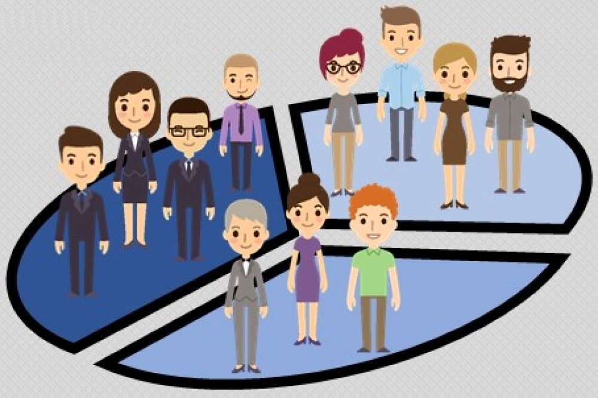

# Customer Segmentation using K Means Clustering

Customer segmentation is the practice of dividing a customer base into groups of individuals that are similar in specific ways relevant to marketing, such as age, gender, interests and spending habits. Customer segmentation can have a great effect on customer management, by dividing customers into different groups that share similar needs, the company can market to each group differently and focus on what each kind of customer needs at any given moment. Large or small, niche customer segments can be targeted depending on the company's resources or needs. K means is one of the most popular clustering algorithm used for segmentation of customers.

#### The goal 
The goal in this project is to apply K means Clustering algorithm and to cluster unlabeled data into k clusters. One of the trickier tasks in clustering is identifying the appropriate number of clusters k.To estimate the value of k, I have used 
- elbow method
- silhouette score method.

#### The dataset
The dataset we will study in this project has been collected from Kaggle (https://www.kaggle.com/vjchoudhary7/customer-segmentation-tutorial-in-python). It contains demographic information such as CustomerID, Age, Gender, Annual Income and Spending Score. Below is some more information on each feature:
Here we have the following features :
1. CustomerID: It is the unique ID given to a customer
2. Gender: Gender of the customer
3. Age: The age of the customer
4. Annual Income(k): It is the annual income of the customer
5. Spending Score: It is the score(out of 100) given to a customer by the mall authorities, based on the money spent and the behavior of the customer.
